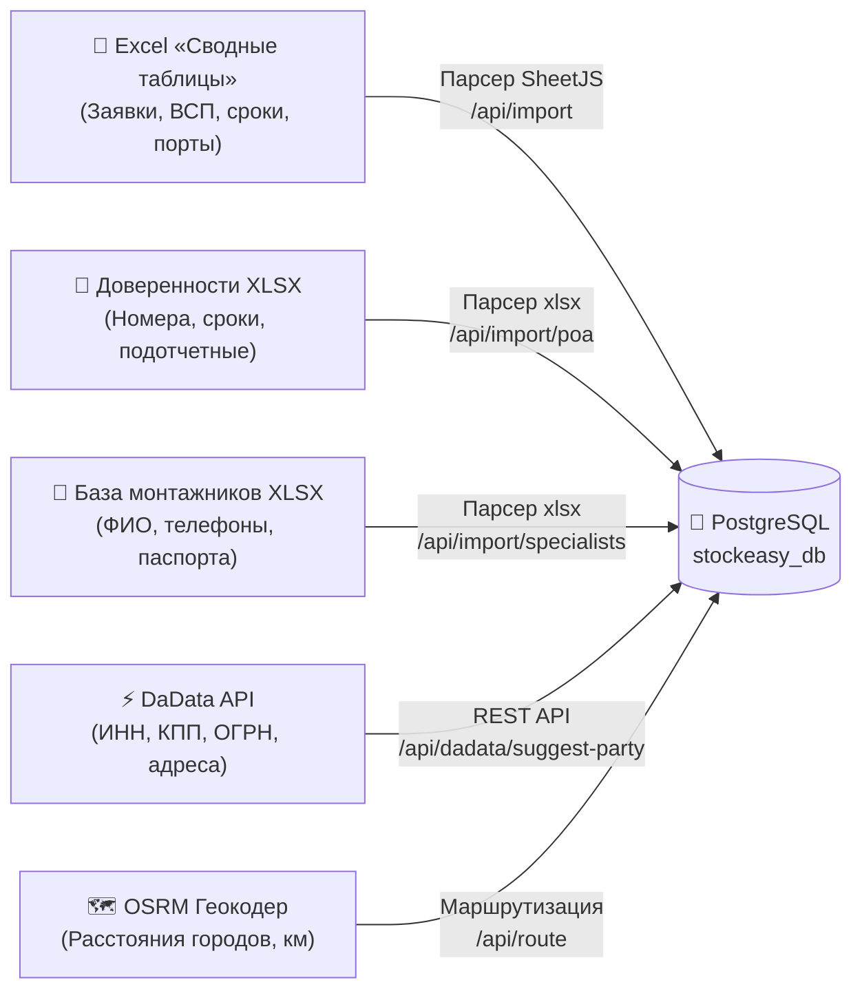
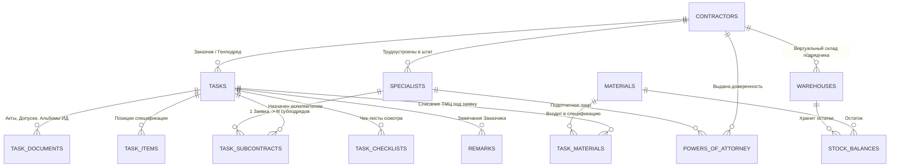
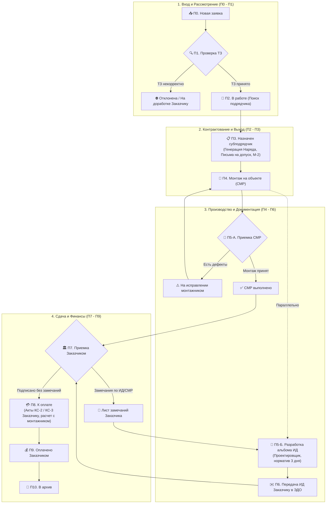
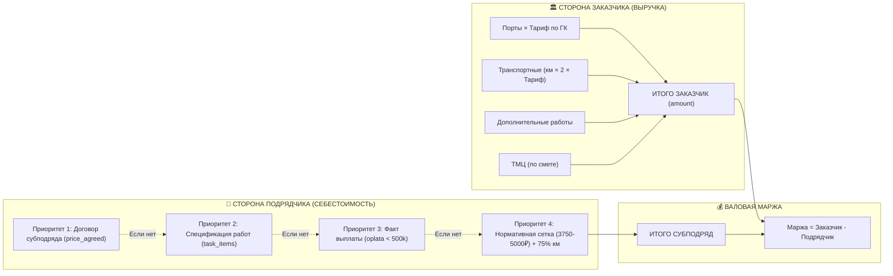

# 🗺️ Полный аудит и Карта функционала системы StockEasy
> **Назначение документа:** Комплексная ревизия и структурированная инвентаризация приложения перед перезагрузкой и синхронизацией с реальным бизнес-процессом (Алексей Чайка, Prilozhenie_StockEasy).  
> **Версия:** 2.0 (Сентябрь 2026) | **База данных:** PostgreSQL (`stockeasy_db`) | **Стек:** Node.js, Express, Vanilla JS, IndexedDB (Offline-First).

---

## Оглавление
1. [Архитектурный фундамент и Хранилище данных](#1-архитектурный-фундамент-и-хранилище-данных)
   - 1.1. Входящие первичные источники данных
   - 1.2. Реестр таблиц PostgreSQL и их назначение
   - 1.3. ER-диаграмма сущностей системы
2. [Сквозные бизнес-процессы (Жизненный цикл заявки)](#2-сквозные-бизнес-процессы-жизненный-цикл-заявки)
   - 2.1. 11 регламентных процессов (П0–П10) и роли
   - 2.2. Блок-схема движения заявки
   - 2.3. Документооборот по этапам
3. [Финансовая математика (Две стороны одной заявки)](#3-финансовая-математика-две-стороны-одной-заявки)
   - 3.1. Сторона Заказчика (Выручка генподрядчика)
   - 3.2. Сторона Подрядчика (Себестоимость СМР)
   - 3.3. Фиксация договоренностей и расчет маржи
4. [Поэкранная анатомия интерфейса (Каждая вкладка, кнопка и модалка)](#4-поэкранная-анатомия-интерфейса)
   - 4.1. Вкладка «Заявки» (Реестр задач)
   - 4.2. Карточка заявки (Модальное окно на 8 вкладок)
   - 4.3. Вкладка «Канбан» (Фазы воронки и доска)
   - 4.4. Вкладка «Организации / Контрагенты» (Заказчики, Подрядчики, Поставщики)
   - 4.5. Вкладка «Люди / Команда» (Пользователи, Монтажники, Доверенности)
   - 4.6. Вкладка «Маршруты / Выезды» (Логистика и удаленность)
   - 4.7. Вкладка «Снабжение / Цепи / ТМЦ» (Склад и заказы)
   - 4.8. Вкладка «Аналитика / Обзор» (7 дашбордов)
   - 4.9. Сервисные разделы: Данные, Чат, AI «Стоки», Инструкция
5. [Карта «Слепых зон» и вопросы для Алексея](#5-карта-слепых-зон-и-вопросы-для-алексея)

---

## 1. Архитектурный фундамент и Хранилище данных

### 1.1. Входящие первичные источники данных



1. **Excel «Сводные таблицы»** — исторический реестр объектов (ПАО Сбербанк, ОСФР). При импорте парсер считывает:
   - Лист Excel (`sheet`), регион (`region`), адрес (`address`), тип объекта (`tip_obj`), номер ГОСБ/ВСП (`gosb`, `vsp`).
   - Даты: дата заявки (`date_zayavki`), крайний срок (`deadline`), дата внесения (`date_vnesen`), дата выхода монтажника (`data_vyhoda`).
   - Физические объемы: порты в заказе (`in_order`), порты фактически (`fact`).
   - Ответственные лица: куратор Заказчика (`manager`), телефон (`contact`), текущий исполнитель (`contractor`).
   - Исходные статусы: обследование (`obsledovanie`), доступ (`dostup`), приёмка (`priemka`), оплата (`oplata`), статус ИД (`id_status`).
   - Финансовые реквизиты: сумма договора (`amount`), удаленность (`distance_km`), ставка за порт (`price_per_unit`), ссылка на техплан (`tech_link`), номер в ЭДО (`edo_number`).
2. **XLSX Доверенностей** — официальные доверенности М-2 на получение оборудования и подписание на объектах.
3. **DaData API** — автоматическое обогащение реквизитов контрагента по ИНН/названию при добавлении подрядчика/поставщика.
4. **OSRM Маршрутизатор** — расчет фактического расстояния от базового города до объекта по дорожной сети РФ.

---

### 1.2. Реестр таблиц PostgreSQL и их назначение

| Таблица базы | Назначение сущности | Ключевые поля |
|---|---|---|
| `tasks` | Основной реестр заявок (8 412 строк) | `id`, `address`, `work_type`, `fact`, `amount`, `macro_status`, `stage_num`, `contractor_id`, `customer_id` |
| `contractors` | Юридические лица и ИП | `id`, `inn`, `kpp`, `name_short`, `type` (`customer` / `subcontractor` / `supplier`), `contract_number` |
| `specialists` | Монтажники и полевые инженеры (188 чел.) | `id`, `full_name`, `phone`, `passport_series_number`, `passport_raw`, `contractor_id`, `organization` |
| `powers_of_attorney` | Доверенности М-2 на монтажников | `id`, `number`, `issue_date`, `valid_until`, `person_name`, `specialist_id`, `contractor_id`, `status` |
| `task_subcontracts` | Исходящие субподряды по видам работ | `id`, `task_id`, `contractor_id`, `specialist_id`, `work_type`, `price_agreed`, `status`, `report_photos` |
| `task_documents` | Прикрепленные и сгенерированные файлы | `id`, `task_id`, `subcontract_id`, `doc_type` (наряд, допуск, акт, ИД), `file_url`, `status` |
| `task_items` | Позиции сметы / спецификации объекта | `id`, `task_id`, `work_type`, `quantity`, `price_customer`, `amount_customer`, `price_contractor`, `amount_contractor` |
| `task_checklists` | Чек-листы обследования объекта (ЗНО) | `id`, `task_id`, `zno_number`, `ports_install`, `mount_surface`, `ceiling_height`, `has_tray`, `server_room` |
| `task_materials` | Материалы под заявку (план/факт) | `id`, `task_id`, `material_id`, `plan_qty`, `fact_qty`, `is_written_off` |
| `materials` | Номенклатурный справочник ТМЦ | `id`, `code`, `name`, `category`, `unit`, `package_qty` (квант), `price_default`, `min_stock_alert` |
| `warehouses` | Склады (центральные, региональные, подрядчиков) | `id`, `name`, `type` (`central`, `regional`, `contractor`), `contractor_id`, `region` |
| `stock_balances` | Текущие остатки на складах | `warehouse_id`, `material_id`, `quantity`, `reserved_qty`, `in_transit_qty` |
| `stock_movements` | Журнал складских перемещений и списаний | `id`, `movement_type` (`receipt`, `transfer`, `task_consumption`), `source_warehouse_id`, `target_warehouse_id` |
| `marches` | Логистические маршруты инженеров | `id`, `name`, `base_city`, `km_rate`, `points` (массив JSONB с точками и привязкой к заявкам) |
| `remarks` | Листы замечаний Заказчика по ИД и СМР | `id`, `task_id`, `body`, `link`, `created_by`, `resolved_by`, `resolution`, `resolution_link` |
| `users` | Учетные записи сотрудников (8 ролей) | `id`, `username`, `password_hash`, `role`, `full_name`, `email`, `phone`, `assigned_regions` |
| `chat_rooms` / `messages` | Внутренний чат по объектам | `id`, `task_id`, `sender_id`, `message_text`, `attachments` |
| `ai_messages` | История запросов к AI-ассистенту | `id`, `user_id`, `mode`, `role`, `content`, `tokens_used`, `rating` |
| `import_meta` | Логирование последнего импорта Excel | `id`, `imported_from`, `imported_at`, `row_count` |

---

### 1.3. ER-диаграмма сущностей системы



---

## 2. Сквозные бизнес-процессы (Жизненный цикл заявки)

### 2.1. 11 регламентных процессов (П0–П10) и роли

Система построена на ролевой модели из **8 ролей**:
* `admin` — Администратор (полный доступ к конфигурации и базам).
* `director` — Руководитель (сквозной аудит, глобальная маржинальность).
* `manager` — Менеджер проекта (первичный разбор, контрактование, контроль сроков).
* `to_engineer` — Инженер ТО / Куратор (проверка качества СМР, сдача объекта Заказчику).
* `logistics` — Логист / Снабженец (резервирование, комплектация, выдача ТМЦ).
* `designer` — Проектировщик (камеральная разработка альбомов ИД, схем и журналов).
* `accountant` — Финансист / Бухгалтер (выставление КС-2/КС-3 Заказчику, сверка выплат монтажникам).
* `installer` — Монтажник (полевой интерфейс: загрузка фото, факт портов, наряды).

| № Процесса | Код процесса | Название этапа | Ответственная роль | Входной документ | Выходной результат |
|---|---|---|---|---|---|
| **П0** | `p0_intake` | Разбор новых заявок | Менеджер | Реестр / Портал Заказчика | Первичная карточка в системе (`new`) |
| **П1** | `p1_review` | Рассмотрение заявки | Менеджер | Карточка + ТЗ Заказчика | Решение: Принято (`review`) / Отклонено (`rejected`) |
| **П2** | `p2_assign` | Подбор и назначение подрядчиков | Менеджер | Согласованный заказ | Созданные субподряды в `task_subcontracts` (`in_progress`) |
| **П3** | `p3_contracting` | Комплектация и контрактование | Логист / Инженер ТО | Субподряды + спецификация | Заказ-наряд (Приложение 2), Письмо на допуск, Доверенность М-2, Накладная ТМЦ (`assigned`) |
| **П4** | `p4_install` | Монтаж на объекте (СМР) | Монтажник | Допуск + Наряд + ТМЦ | Фотоотчет узлов, кабельный журнал, порты (`install`) |
| **П5-А** | `p5a_acceptance_smr`| Приемка СМР и устранение дефектов | Инженер ТО | Фотоотчеты монтажника | Приемка монтажа (`smr_done`) либо возврат на исправление (`correction`) |
| **П5-Б** | `p5b_design_id` | Разработка ИД *(Параллельный процесс)* | Проектировщик | Кабельные журналы + замеры | Готовый альбом чертежей ИД (норматив 3 дня) (`id_in_progress`) |
| **П6** | `p6_handover_id` | Передача ИД Заказчику | Инженер ТО | Альбом ИД | Реестр передачи, отправка в ЭДО Заказчика (`id_delivered`) |
| **П7** | `p7_customer_acceptance`| Финальная приемка Заказчиком | Менеджер | Сданный СМР + Согласованная ИД | Подписанный протокол/акт Заказчика (`accepted`) |
| **П8-А** | `p8a_subcontractor_payment`| Расчеты с Подрядчиками | Бухгалтер | Акты и отчеты субподрядчиков | Платежное поручение, закрывающий акт подрядчика (`billing`) |
| **П8-Б** | `p8b_customer_billing`| Закрытие с Заказчиком | Бухгалтер | Финальный акт Заказчика | Акты КС-2, справки КС-3, счет Заказчику (`billing`) |
| **П9** | `p9_payment` | Оплата от Заказчика | Бухгалтер | Банковская выписка | Факт прихода денег на р/с, закрытие заявки (`paid`) |
| **П10**| `p10_archive` | Архив заявок | Администратор | Закрытый пакет документов | Перенос в неизменяемый архив (`archived`) |

---

### 2.2. Блок-схема движения заявки



---

## 3. Финансовая математика (Две стороны одной заявки)

В системе реализовано строгое разделение экономики на **выручку от Заказчика** и **себестоимость субподряда**.



### 3.1. Сторона Заказчика (Выручка)
Функция в коде: `getTaskFinance(t)` ([`public/js/helpers.js:399`](file:///c:/stockeasy_local/public/js/helpers.js#L399))
* **Работа:** `Порты (fact или inOrder) × Тариф за порт (pricePerUnit)`.
* **Удаленность:** `distanceKm × 2 × kmRate` (по умолчанию 35–70 ₽/км в обе стороны).
* **Допы:** `extras` (согласованные доп. объемы).
* **ТМЦ:** `tmc` (компенсация материалов Заказчиком).
* **Итоговая сумма договора:** `work + transport + extras + tmc`. Если эти поля не заполнены, берется исходное поле `amount` из выгрузки Excel.

### 3.2. Сторона Подрядчика (Себестоимость СМР)
Функция в коде: `getTaskContractorFinance(t)` ([`public/js/helpers.js:425`](file:///c:/stockeasy_local/public/js/helpers.js#L425))  
Расчет себестоимости субподряда построен на **4-уровневом каскаде**:
1. **Приоритет 1 (Зафиксированный субподряд):** Если в карточке заявки заполнен исходящий субподряд в `task_subcontracts`, сумма берется строго из `price_agreed`.
2. **Приоритет 2 (Спецификация):** Если в `task_items` есть позиции со ставками подрядчика, сумма = `∑(количество × price_contractor) + транспорт`.
3. **Приоритет 3 (Прямая выплата из Excel):** Если заполнено поле `t.oplata` и сумма меньше 500 000 ₽ (защита от номеров платежных поручений типа `4503903976`), берется эта цифра.
4. **Приоритет 4 (Нормативная тарифная сетка СМР):**
   * Если портов $\ge 3$ ➔ **3 750 ₽ / порт**
   * Если портов $= 2$ ➔ **4 250 ₽ / порт**
   * Если порт $= 1$ ➔ **5 000 ₽ / порт**
   * Если порты не указаны, но есть сумма работ Заказчика ➔ норматив **58% от сметы Заказчика**.
   * Транспортные монтажнику ➔ **75% от транспортных Заказчика**.

---

## 4. Поэкранная анатомия интерфейса

### 4.1. Вкладка «Заявки» (Реестр задач)
Основной рабочий экран диспетчера и менеджера проекта ([`public/js/pages/tasks.js`](file:///c:/stockeasy_local/public/js/pages/tasks.js)).

```
┌────────────────────────────────────────────────────────────────────────────────────────────────────────┐
│ [🔍 Поиск: номер, адрес, ВСП, контакт...]  [🎛️ Фильтры (активно: 2)]  [Режим: Заказчик | Подрядчики]    │
├────────────────────────────────────────────────────────────────────────────────────────────────────────┤
│ (Выбранные фильтры: [Регион: Новосибирская обл. ✕] [Только с удаленностью ✕] [Сбросить все])           │
├────────────────────────────────────────────────────────────────────────────────────────────────────────┤
│ [Всего: 8 412]   [В работе: 3 140]   [Готово: 4 820]   [Оплачено: 410]   [Сумма: 495 620 400 ₽]        │
├────────┬─────────────────┬────────────────────┬──────────┬───────────┬────────┬───────┬─────────┬──────┤
│  №/Код │  Адрес объекта  │     Что делать     │ Дедлайн  │    Этап   │ Статус │Сколько│Подрядчик│За ск.│
├────────┼─────────────────┼────────────────────┼──────────┼───────────┼────────┼───────┼─────────┼──────┤
│ББ-5376 │г. Новосибирск...│Монтаж СКС 4 порта  │15.10.2026│3. Монтаж  │В работе│   4   │ООО Спец │15 000│
└────────┴─────────────────┴────────────────────┴──────────┴───────────┴────────┴───────┴─────────┴──────┘
```

#### Элементы управления и действия:
1. **Строка умного поиска (`#tq`):** ищет на лету по любому слову или фрагменту (номер заявки, город, улица, номер ВСП, ГОСБ, фамилия куратора, телефон, подрядчик).
2. **Кнопка «Фильтры» (`toggleTasksFilters`):** открывает компактную сворачиваемую панель с селектами:
   - Регион, Заказчик, Менеджер, Этап (П0–П10), Статус выполнения, Приоритет, Просрочка, Подрядчик, Удаленность (>0 км), Год.
   - Кнопка **«Применить фильтры»** пересчитывает таблицу без перезагрузки страницы.
   - Бейджи активных фильтров с крестиком `[✕]` позволяют быстро отменять фильтры по одному.
3. **Переключатель «Режим финансов» (`setTaskFinanceMode`):**
   - **`[Заказчик]`** — отображает тариф за порт Заказчика и полную смету договора.
   - **`[Подрядчики]`** — отображает себестоимость выплаты монтажникам, ставку субподряда и валовую маржу генподрядчика в рублях и процентах.
4. **Фильтр этапов воронки:** быстрые кнопки `[Все]`, `1. Заявка`, `2. Обследование`, `3. Монтаж`, `4. Контроль`, `5. Приёмка`, `6. Оплата`.
5. **Таблица заявок (10 колонок с адаптивной шириной):**
   - `№ / Код`: ID заявки, бейдж заказчика («ПАО Сбербанк» / «ОСФР»), дата поступления.
   - `Адрес объекта`: субъект РФ, чистый адрес, номер ГОСБ и ВСП.
   - `Что делать`: тип работ, категория объекта, контактное лицо на объекте.
   - `Дедлайн`: дата сдачи, цветовой индикатор (красный — просрочено N дней, оранжевый — дедлайн близко).
   - `Этап`: текущий макро-статус по регламенту П0–П10.
   - `Сколько`: фактическое количество портов / плановое по заказу.
   - `Подрядчик`: наименование назначенного субподрядчика. Клик открывает модалку быстрого назначения исполнителя.
   - `Почём`: ставка за единицу (порт).
   - `За сколько`: итоговая стоимость (в режиме Заказчика — выручка, в режиме Подрядчика — выплата + маржа).
   - `Действия`:
     * Кнопка **«Открыть»** ➔ переход в полную карточку объекта.
     * Кнопка **«Акт / Письмо»** ➔ моментальное скачивание заполненного Word (.docx) или Приложения 2 (Excel).

---

### 4.2. Карточка заявки (Модальное окно на 8 вкладок)
Файл реализации: [`public/js/pages/card.js`](file:///c:/stockeasy_local/public/js/pages/card.js) (112 КБ логики).

Включает 8 функциональных закладок:
1. **«Основное» (`main`):**
   - Интерактивная карта объекта (Leaflet OpenStreetMap) с автоматическим геокодированием адреса через Nominatim.
   - Кнопка прямого перехода в 2ГИС / Яндекс.Карты.
   - Контактные данные представителя Заказчика на объекте.
   - Регламентный статус П0–П10 с кнопкой перевода на следующий шаг («Начать монтаж», «Завершить СМР», «Взять ИД в работу», «Передать на оплату»).
   - История всех правок с фиксацией автора и даты.
2. **«Спецификация» (`items`):**
   - Сметные строки видов работ (СКС, ВОЛС, электрика, демонтаж).
   - Расценки Заказчика vs Расценки Подрядчика.
3. **«Чек-листы» (`checklists`):**
   - Опросный лист обследования ЗНО: тип стен (гипсокартон, кирпич, бетон), высота потолков, наличие серверной, телеком-шкафа, кабельных лотков, свободных портов на патч-панели.
4. **«Субподряды» (`subcontracts`):**
   - Назначение исполнителей на конкретные объемы.
   - Фиксация согласованной цены субподряда (`price_agreed`).
   - Назначение бригадира монтажников с паспортными данными для допуска.
5. **«Документы» (`documents`):**
   - Автоматическая генерация документов по ГОСТ и регламенту:
     * *Заказ-наряд (Приложение 2)* в формате Excel.
     * *Служебная записка на допуск монтажников* в Word (.docx).
     * *Акт выполненных работ*.
     * *Альбом ИД*.
6. **«Вложения и Фото» (`attachments`):**
   - Фотоотчеты скрытых работ, кабельных трасс, рабочих мест, узлов коммутации.
7. **«Замечания» (`remarks`):**
   - Реестр замечаний куратора Заказчика с указанием листа/чертежа ИД.
   - Фиксация устранения замечания проектировщиком с прикреплением ссылки на обновленный альбом.
8. **«Порты и Кабельный журнал» (`ports`):**
   - Таблица прозвонки портов: номер порта, патч-панель, розетка, длина кабельной линии в метрах.

---

### 4.3. Вкладка «Канбан» (Фазы воронки и доска)
Файл реализации: [`public/js/pages/kanban.js`](file:///c:/stockeasy_local/public/js/pages/kanban.js).

* **Полноэкранный Trello/Jira-режим (`100vh`):**
  - Шапки колонок и полоса горизонтальной прокрутки зафиксированы в поле зрения (скроллбар не убегает вниз при большом числе карточек).
  - Поддержка горизонтального скролла колесиком мыши (Shift+Wheel или курсор над свободной областью) и кнопками `◀` / `▶`.
* **4 логические вкладки по фазам воронки (`KANBAN_PHASES`):**
  1. `[ 🌐 Все 10 этапов ]` — сквозной конвейер компании.
  2. `[ 📥 1. Вход и ТЗ (Этапы 1–3) ]` — Новые, На рассмотрении, Отклонены.
  3. `[ 🤝 2. Назначение (Этапы 4–5) ]` — Поиск подрядчика, Назначено / ТМЦ.
  4. `[ 🔧 3. СМР и ИД (Этапы 6–8) ]` — В монтаже, СМР выполнено, ИД в разработке.
  5. `[ 🏛️ 4. Сдача и Оплата (Этапы 9–10) ]` — На приёмке Заказчиком, К оплате / Оплачено.
* **Интеллектуальное управление колонками:**
  - Кнопка **`[ ↕ Свернуть пустые (N) ]`** — в один клик сжимает неактивные колонки с 0 задач в узкие полоски 42px.
  - Каждую колонку можно индивидуально свернуть/развернуть кнопкой `[—]` / `[+]`.
  - Карточки поддерживают Drag-and-Drop между колонками с автоматической валидацией прав роли.

---

### 4.4. Вкладка «Организации / Контрагенты»
Файл реализации: [`public/js/pages/contractors.js`](file:///c:/stockeasy_local/public/js/pages/contractors.js).

* **3 категории контрагентов:**
  1. **Заказчики:** ПАО Сбербанк, ОСФР и др. Привязаны генеральные контракты.
  2. **Подрядчики СМР:** Монтажные организации и ИП, выполняющие работы в регионах.
  3. **Поставщики ТМЦ:** ЭТМ, Русский Свет, ДКС, ТК Деловые Линии, СДЭК.
* **Интеграция с DaData:**
  - При создании организации достаточно начать вводить ИНН или название компании — система автоматически заполняет КПП, ОГРН, полное юридическое наименование, адрес регистрации и ФИО Генерального директора.
* **Карточка подрядчика:**
  - Просмотр штата монтажников организации.
  - Просмотр действующих доверенностей М-2 со статусами (действует / просрочена).
  - Кнопка **«+ Добавить монтажника»**:
    * Оснащена **живым автодополнением** по базе из 188 специалистов.
    * При выборе человека из базы автоматически подтягиваются телефон, должность, серия/номер паспорта и орган выдачи.
    * **Концепция «Покрасить»:** если человек уже есть в базе, дубликат строки НЕ создается — специалист привязывается к текущему подрядчику с обновлением контактов.

---

### 4.5. Вкладка «Люди / Команда»
Файл реализации: [`public/js/pages/users.js`](file:///c:/stockeasy_local/public/js/pages/users.js).

Содержит 3 независимых справочника:
1. **«Сотрудники системы»:**
   - Учетные записи с логинами и паролями, привязка к одной из 8 ролей (`admin`, `manager`, `to_engineer`, `designer` и т.д.), закрепленные регионы ответственности.
2. **«Специалисты / Монтажники»:**
   - Единый справочник монтажников (188+ человек).
   - Фильтр «Только с паспортом» (для быстрой подготовки писем на допуск СБ).
   - Полнотекстовый поиск по ФИО, телефону, номеру паспорта.
   - Форма добавления специалиста с автодополнением во избежание дублей.
3. **«Доверенности (М-2)»:**
   - Реестр выданных доверенностей с номерами (например, `0УБП-000450`), датами выдачи и сроками действия.
   - Автоматическая подсветка просроченных доверенностей красным бейджем.
   - Автодополнение подотчетного лица из базы специалистов и контрагента из базы организаций.

---

### 4.6. Вкладка «Маршруты / Выезды»
Файл реализации: [`public/js/pages/marches.js`](file:///c:/stockeasy_local/public/js/pages/marches.js).

* Инструмент планирования кустовых выездов монтажных бригад по удаленным объектам региона (Чита, Шилка, Забайкальск и др.).
* **Формирование маршрута:**
  - Задается базовый город отправления и тариф за км (по умолчанию 70 ₽/км).
  - Добавление точек маршрута с автодополнением по номеру заявки или адресу.
  - При выборе заявки система автоматически связывается с OSRM геокодером, рассчитывает расстояние по дорогам от базы до объекта и подставляет километраж, количество портов и ставку.
  - Расчет стоимости выезда: `Удаленность = км × 2 × тариф`.

---

### 4.7. Вкладка «Снабжение / Цепи / ТМЦ»
Файл реализации: [`public/js/pages/supply.js`](file:///c:/stockeasy_local/public/js/pages/supply.js).

* **Каталог материалов:** кабель витая пара (бухты 305м), патч-панели 24/48 портов, модули Keystone RJ-45, патч-корды, розетки, кабель-каналы.
* **Управление складами:** центральный склад компании, региональные склады, виртуальные склады субподрядчиков (материалы, переданные в подотчет бригадам).
* **Складские операции:**
  - Поступление ТМЦ от поставщиков (ЭТМ).
  - Перемещение между складами.
  - Списание материалов под конкретный ID заявки по фактическому расходу монтажника.
* **Заказы поставщикам (`purchase_orders`):** формирование заказов на закупку, контроль сроков поставки и неснижаемых остатков.

---

### 4.8. Вкладка «Аналитика / Обзор»
Файл реализации: [`public/js/pages/dashboard.js`](file:///c:/stockeasy_local/public/js/pages/dashboard.js).

Включает 7 аналитических срезов:
1. `dash-summary` — общая воронка компании, конверсия этапов, просрочки, общая маржа.
2. `dash-customers` — рейтинг и объемы по Заказчикам (ПАО Сбербанк vs ОСФР).
3. `dash-executors` — аналитика выработки подрядчиков и монтажных бригад.
4. `dash-calendar` — производственный календарь дедлайнов и выходов на объекты.
5. `dash-materials` — статистика расхода кабеля и ключевых комплектующих.
6. `dash-payments-in` — график ожидаемых поступлений оплат от Заказчиков.
7. `dash-payments-out` — график кредиторской задолженности перед субподрядчиками.

---

### 4.9. Сервисные разделы

* **«Данные» (`data.js`):** страница импорта файлов «Сводные таблицы» (Excel), экспорта резервных копий, сброса кэша и синхронизации.
* **«Чат» (`chat.js`):** корпоративный чат с комнатами по каждому объекту/заявке с поддержкой прикрепления файлов.
* **«Стоки» (AI-ассистент, `ai.js`):** чат с искусственным интеллектом, знающим структуру базы данных. Поддерживает голосовой ввод, аналитические запросы («покажи топ просроченных заявок в Иркутске») и цепочки автоматизаций (Workflows).
* **«Инструкция» (`help.js`):** интерактивная база знаний с описанием регламента шагов, обучающими подсказками и справочником ролей.

---

## 5. Карта «Слепых зон» и вопросы для Алексея

Ниже собраны **10 ключевых развилок**, где текущая программная логика может расходиться с реальным регламентом бизнеса Алексея:

1. **Модель расчета подрядчиков (Главный вопрос):**
   * *Как в коде сейчас:* Если нет фиксированного субподряда, берется сетка `3750 / 4250 / 5000 ₽` за порт либо 58% от сметы Заказчика.
   * *Вопрос Алексею:* Это реальная сетка расценок, по которой вы платите бригадам, или у вас действует совсем другой прайс-лист / индивидуальные договоренности по каждому региону?
2. **Поле `oplata` в выгрузках Excel:**
   * *Как в коде сейчас:* Значения выше 500 000 ₽ отсекаются как номера платежек SAP/1C.
   * *Вопрос Алексею:* Что на самом деле должно лежать в поле `oplata` в первичном файле — факт оплаты Заказчиком, платежка или сумма выплаты монтажнику?
3. **Цепочка этапов: 10 этапов ИД vs 6 этапов Заявки:**
   * *Как в коде сейчас:* Существуют параллельно макро-статусы П0–П10 (`new`...`paid`) и старые этапы (`request`, `survey`, `install`, `control`, `acceptance`, `payment`).
   * *Вопрос Алексею:* Оставляем единую сквозную линейку из 10 этапов (П0–П10) или нужна более простая воронка?
4. **Концепция «Покрасить» монтажника:**
   * *Как в коде сейчас:* Монтажник перепривязывается к новому субподрядчику (`contractor_id` обновляется).
   * *Вопрос Алексею:* Может ли один и тот же монтажник работать одновременно на 2 разных субподрядчика (связь многие-ко-многим), или монтажник жестко закреплен только за одной организацией в конкретный момент времени?
5. **Кто формирует и отправляет альбом ИД:**
   * *Как в коде сейчас:* Проектировщик загружает ссылку на ИД, а отправляет инженер ТО / диспетчер.
   * *Вопрос Алексею:* Кто у вас физически загружает ИД на портал Заказчика и через какие каналы (ЭДО, почта, портал Сбера)?
6. **Удаленность и километраж:**
   * *Как в коде сейчас:* Автоматический расчет OSRM `км × 2 × 70 ₽`.
   * *Вопрос Алексею:* Всегда ли оплачивается километраж в оба конца? С какого километра начинается оплата удаленности (от 0 км, от 10 км, от 50 км)?
7. **Чек-лист обследования (ЗНО):**
   * *Как в коде сейчас:* Огромный чек-лист на 30 параметров (высота потолков, фальшпол, лотки, серверная).
   * *Вопрос Алексею:* Монтажники реально заполняют все эти 30 полей на объекте, или нужен сокращенный чек-лист из 5–7 главных пунктов?
8. **Ролевой доступ к деньгам:**
   * *Как в коде сейчас:* Монтажники видят только режим подрядчика, менеджеры видят всё.
   * *Вопрос Алексею:* Должен ли монтажник или субподрядчик видеть сумму договора с генеральным Заказчиком (Сбером), или их доступ должен быть строго ограничен только их собственной выплатой?
9. **Списание материалов со склада:**
   * *Как в коде сейчас:* Автоматическое резервирование по типовику и списание по факту монтажа.
   * *Вопрос Алексею:* Ведется ли у вас реальный учет бухт кабеля и патч-панелей по складам в программе, или снабжение пока ведется во внешних таблицах/1С?
10. **Финальный закрывающий документ:**
    * *Как в коде сейчас:* Генерация Приложения 2 (Excel) и письма на допуск (Word).
    * *Вопрос Алексею:* Какие еще формы документов генерируются автоматически (КС-2, КС-3, М-29, Акт освидетельствования скрытых работ)?
